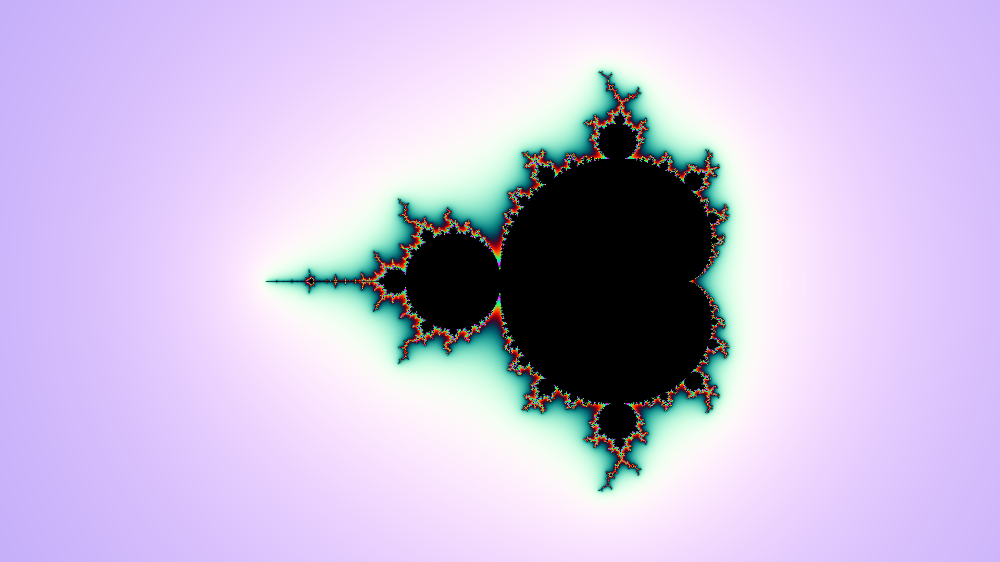

# Fractoid

Fractoid is a free software to paint beautiful fractal images. Fractoid consists of a dependency-free library,
command line interface and graphical user interface.

## Installation

To compile the library along with the executables, navigate to the project folder and run `cmake .`
followed by `make`. Both binaries will be compiled into the *bin* folder. If OpenMP is available it will be used to
parallelize some important *for* loops. Graphical user interface will be compiled only if *Qt5* is installed. On Linux,
you can install *Qt5* by running the following command.
```c++
sudo apt install qt5-default
```

## Usage

### Library

To create a fractal object, simply call the class constructor with the required parameters.
```c++
Mandelbrot fractal(50, 10);
```
After initialization of the fractal object, we need to create an `Algorithm` object, which will hold a specified method
of generation. For demonstration purposes, we can use smoothed periodic coloring with an example seed of 34.
```c++
Algorithm alg = Algorithm::periodic(true, 34);
```
For the fractal to have a black filling, we need to specify the fill color. If you don't specify the fill color, the
color will be determined based on the number of iteration before bail in the fractal.
```c++
alg.color(0, 0, 0);
```
Now it's time to paint the fractal in the `Image` object. We need to specify the center, zoom, algorithm and resolution.
```c++
Image image = fractal.paint(-0.75, 0, 1, alg, 1920, 1080);
```
We can then save the image into a `.png` file.
```c++
image.save("fractal.png");
```
If you followed these steps carefully, the following image will be generated.



### CLI

The usage of the CLI is pretty straightforward. To see all the available options simply run the `fractoid-cli`
executable without any arguments. To replicate the image above, run the following command.
```shell
./fractoid-cli mandelbrot -b 10 -f 0 0 0 -i 50 -l -0.75 0 -s 34 --smooth
```
